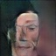

# DCGAN  

This project consists on training a DCGAN network on PyTorch using Python and import it into C++.
This scenario is quite attracting because mixes the the friendliness to code and test from Python with the 
computational speed of C++.

A Deep Convolutional Generative Adversarial Networks (DCGAN) is composed of 2 NN, one Generator and one Discriminator.
The objective of the Generator is to create synthesized images from random noise that look real, in order to cheat the Discriminator.
The Discriminator needs to decide if an image is real or not. Both networks are trained at the same time.

To run this project:
- You need to download the dataset from <http://mmlab.ie.cuhk.edu.hk/projects/CelebA.html> (in Google Drive go to Img > 
img_align_celeba.zip).
- Modify the dataset::path from [celebA_opt.yaml](celebA_opt.yaml) to point to the downloaded dataset.
- Modify the [CMakeList](CMakeLists.txt) attributes Torch_DIR and OpenCV_DIR to point to your Torch and OpenCV folders.
- Run train_dgan: `$ python train_dgan.py`
- If you want to avoid training the network the final model for the Generator and Degenerator is saved in models.
- Build and run from_python.cpp to see how the network behabes in C++.

Some examples of the generated images after being trained for 5 epochs (I just have a CPU) are:

     

